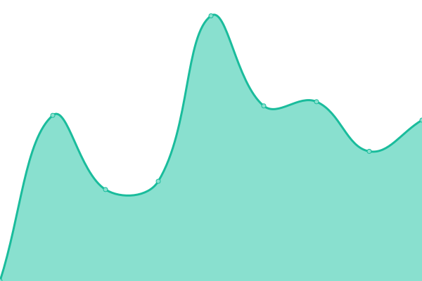

# [📈 Live Status](https://antislang.github.io/uptime): <!--live status--> **🟩 All systems operational**

This repository contains the open-source uptime monitor and status page for [AntiSlang](https://antislang.github.io/uptime), powered by [Upptime](https://github.com/upptime/upptime).

With [Upptime](https://upptime.js.org), you can get your own unlimited and free uptime monitor and status page, powered entirely by a GitHub repository. We use [Issues](https://github.com/antislang/uptime/issues) as incident reports, [Actions](https://github.com/antislang/uptime/actions) as uptime monitors, and [Pages](https://antislang.github.io/uptime) for the status page.

<!--start: status pages-->
<!-- This summary is generated by Upptime (https://github.com/upptime/upptime) -->
<!-- Do not edit this manually, your changes will be overwritten -->
<!-- prettier-ignore -->
| URL | Status | History | Response Time | Uptime |
| --- | ------ | ------- | ------------- | ------ |
|  [Малай Воровской Филиал](https://backend.isbotdown.com/bots/picturestovkbot) | 🟩 Up | [malaj-vorovskoj-filial.yml](https://github.com/AntiSlang/uptime/commits/HEAD/history/malaj-vorovskoj-filial.yml) | 

 445ms
     
 | 

<a href="https://antislang.github.io/uptime/history/malaj-vorovskoj-filial">100.00%</a>
    

|  [EmojiSongBot](https://backend.isbotdown.com/bots/emojisongbot) | 🟩 Up | [emoji-song-bot.yml](https://github.com/AntiSlang/uptime/commits/HEAD/history/emoji-song-bot.yml) | 

 109ms
     
 | 

<a href="https://antislang.github.io/uptime/history/emoji-song-bot">100.00%</a>
    

|  [AntiSlang.com](https://antislang.com) | 🟩 Up | [anti-slang-com.yml](https://github.com/AntiSlang/uptime/commits/HEAD/history/anti-slang-com.yml) | 

 1616ms
     
 | 

<a href="https://antislang.github.io/uptime/history/anti-slang-com">100.00%</a>
    

<!--end: status pages-->

[**Visit our status website →**](https://antislang.github.io/uptime)
